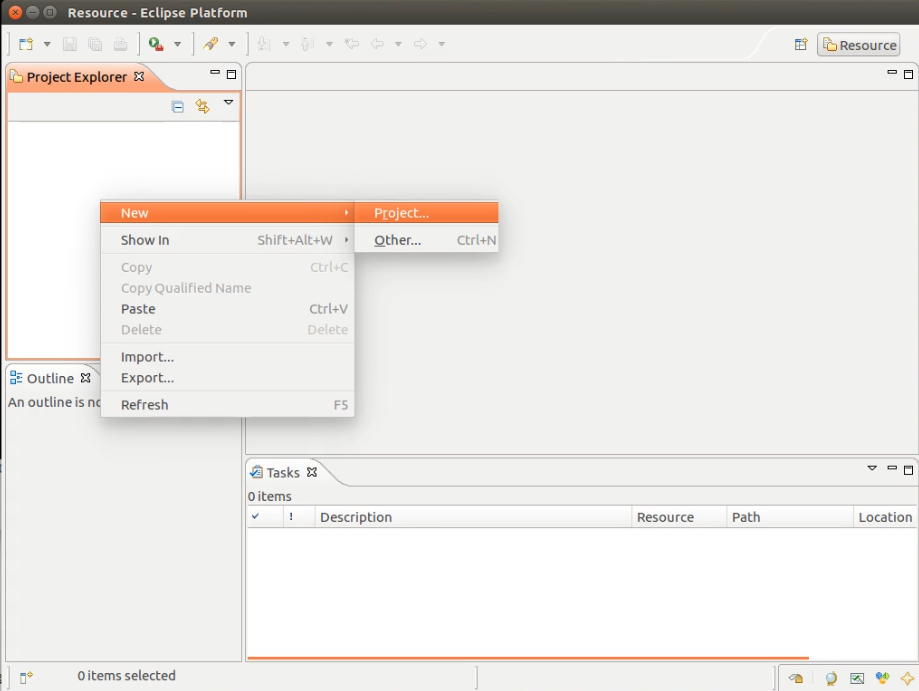
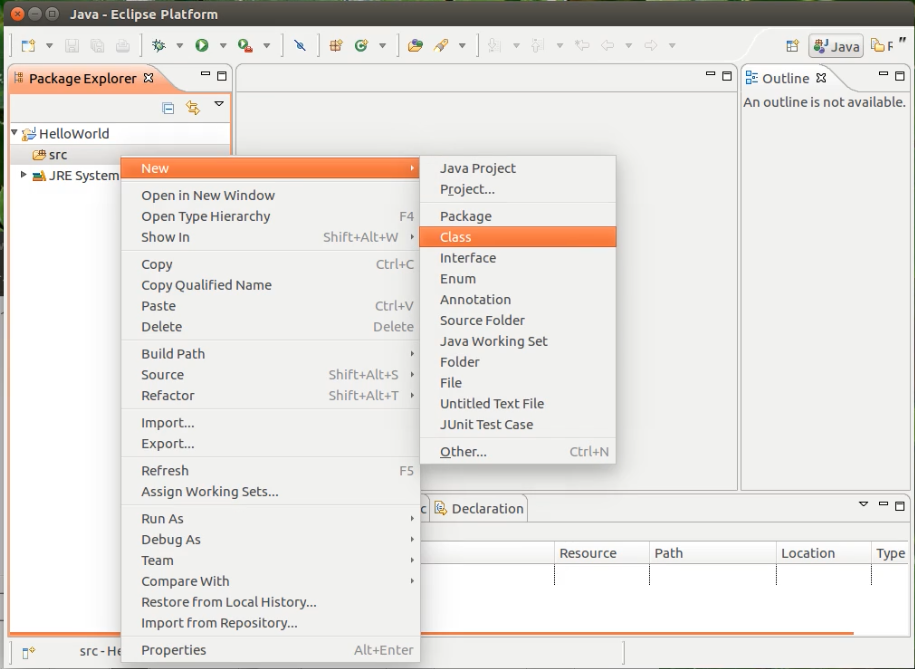

# **Eclipeを使おう**

## Eclipseとは
EclipseとはJavaの統合開発環境と呼ばれるもので、これひとつで、Javaプログラミング、コンパイル、実行のすべてができるツールです。さらにデバッグも自動で行ってくれるため、プログラミングの効率も向上するでしよう。

## Eclipseの使い方
では、さっそく Eclipseを使ってみましょう。

まず、Eclipseを起動すると、このようなものが出てきます。
ここは、そのままOKを押してください。

[](
  画像を修正しておく
)


<br>
すると↓の画面がでてくるので、workbenchをクリック


<br>
この画面が出てきます。


<br>
次に、Project Explorerとかいてあるところの下の、白い枠を右クリックし、
New　→　Project を選択します。



<br>
Java Project を選択して、Next> をクリック


<br>
Project name: のところに、今回は、HelloWorldと入力。


<br>
このような画面がでてきます。


<br>
HelloWorldのところをダブルクリックすると、srcというフォルダが出てきます。

srcを右クリック → New → Class を選択


<br>
<br>
次に

1. Name: のところに、HelloWorldと入力

1. public static void main(String[] args)　のところにチェックを入れる

3. Finishをクリック


すると、この画面がでてきます。


ここで、ちょとしたプログラムをかいてみます。
public static void main(String[] args){ という行の下に、
```java
System.out.println("HelloWorld");
```
と追加します。

プログラムを実行するときは、左上のほうの、緑色の三角ボタンを押してください。

