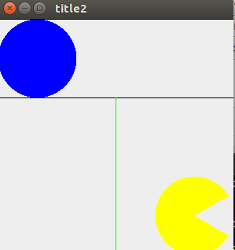

# Swing の基本

## Swing とは
> Javaで、GUIアプリケーションを作るのに使用されるのが、Swingです。

## 画面を表示してみよう
```java
import javax.swing.JFrame;

public class SwingSample1 {
	public static void main(String[] args) {
		JFrame frame = new JFrame("Title");
		frame.setDefaultCloseOperation(JFrame.EXIT_ON_CLOSE);
		frame.setSize(800, 600);
		frame.setVisible(true);
	}
}
```
このプログラムを実行すると、以下のようなウィンドウが表示されます。


次に、この画面にHelloWorldと表示させてみます。

```java
import java.awt.*;
import javax.swing.*;

public class SwingSample2 {

  public static void main(String[] args) {
    SwingSample2 sample2 = new SwingSample2();
  }

  public SwingSample2() {
    JFrame frame = new JFrame("title2");
    frame.setDefaultCloseOperation(JFrame.EXIT_ON_CLOSE);
    frame.setSize(300, 300);
    frame.setVisible(true);

    MyJPanel myJPanel = new MyJPanel();
    frame.getContentPane().add(myJPanel);

    myJPanel.setBounds(0, 0, 300, 300); // 学内環境だと必要
  }

  class MyJPanel extends JPanel {

    @Override
    public void paintComponent(Graphics g) {
      g.drawString("Hello, world!", 100, 100);
    }
  }

}
```
重要なのは、下のほうにある、 g.drawString(”Hello World”,100,100); という命令です。これは、Hello Worldという文字を、ウィンドウ中の左から100、上から100の場所に書く命令です。ここで、注意すべき点が、Swingは基準点が左上ということです。ちょっと紛らわしいですが、間違わないようにしてください。

## 図形、画像の表示

Graphics クラスを使って図形を描いてみましょう。Graphics クラスを使うと 線を引いたり四角形を書いたりできます。

```java
import java.awt.*;
import javax.swing.*;

public class SwingSample3 {
	public static void main(String[] args) {
		SwingSample3 sample3 = new SwingSample3();
	}

	public SwingSample3() {
		JFrame frame = new JFrame("title2");
		frame.setDefaultCloseOperation(JFrame.EXIT_ON_CLOSE);
		frame.setSize(300, 300);
		frame.setVisible(true);

		MyJPanel myJPanel = new MyJPanel();
		frame.getContentPane().add(myJPanel);

		myJPanel.setBounds(0, 0, 300, 300); // 学内環境だと必要
	}

	class MyJPanel extends JPanel {
		@Override
		public void paintComponent(Graphics g) {
			g.setColor(Color.BLUE);
			g.fillOval(0, 0, 100, 100);

			g.setColor(Color.BLACK);
			g.drawRect(0, 0, 300, 100);

			g.setColor(Color.GREEN);
			g.drawLine(150, 100, 150, 300);

			g.setColor(Color.YELLOW);
			g.fillArc(200, 200, 100, 100, 30, 300);
		}
	}
}
```
実行結果



#### 直線を描く
直線を描くには、drawLineメソッドを使います。
```java
g.drawLine(150, 100, 150, 300);
```
これは、点（150,100）から点（150,300）まで線を描くという命令です。

#### 四角形を描く
四角形を描くには、drawRectメソッドを使います。
```java
g.drawRect(0, 0, 300, 100);
```
(0,0)の座標を左上とした、幅が300、高さが100の長方形が描かれます。

また、fillRectメソッドを使うと、中を塗りつぶした長方形を描くことができます。
```java
g.fillRect(0, 0, 300, 100);
```

#### 円を描く
円を描くには、drawArc メソッドを使います。
```java
g.fillArc(200, 200, 100, 100, 30, 300);
```
(200, 200)から(100, 100)への四角形の中にすっぽり入るような円が描けます。
<br>
また、５つ目と６つ目の引数は、円の孤を描く角度を指定できます。
例えば、０,360と指定すれば、１回転、つまり円が描けますし、0,180と指定すれば、半円が描けます。

#### 色の付け方
drawRectなどの前に、setColorというメソッドを追加すれば、図形に色をつけることができます。
```java
g.setColor(Color.BLUE);
```
使える色の一覧を下の表に載せておきます。

| 名前 | 色 |
|:----|:----|
| Color.BLACK | 黒 |
| Color.BLUE | 青 |
| Color.CYAN | シアン |
| Color.DARK_GRAY | 暗い灰色 |
| Color.GRAY | 灰色 |
| Color.GREEN | 緑 |
| Color.LIGHT_GRAY | 明るい灰色 |
| Color.MAGENTA | マゼンタ |
| Color.ORANGE | オレンジ |
| Color.PINK | ピンク |
| Color.RED | 赤 |
| Color.WHITE | 白 |
| Color.YELLOW | 黄色 |

## 画像の表示
```java
import java.awt.*;
import java.io.*;
import javax.imageio.ImageIO;
import javax.swing.*;

public class SwingSample4 {

    public static void main(String[] args) {
        SwingSample4 swingSample4 = new SwingSample4();
    }

    public SwingSample4() {
        JFrame frame = new JFrame("title2");
        frame.setDefaultCloseOperation(JFrame.EXIT_ON_CLOSE);
        frame.setSize(300, 300);
        frame.setVisible(true);

        MyJPanel myJPanel = new MyJPanel();
        frame.getContentPane().add(myJPanel);
        myJPanel.setBounds(0, 0, 300, 300);
    }

    class MyJPanel extends JPanel {
        @Override
        public void paintComponent(Graphics g) {
            try {
                Image image = ImageIO.read(new File("image/haikei.jpg"));
                g.drawImage(image, 0, 0, this);

            } catch (IOException e) {
                e.printStackTrace();
            }
        }
    }

}
```
imageという名前のフォルダを作って、そこに画像を入れるようにしましょう。

```java
Image image = ImageIO.read(new File("image/haikei.jpg"));
g.drawImage(image, 0, 0, this);
```
new Fileの中身は、"image/画像の名前" のように画像を指定します。
