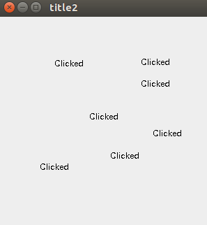
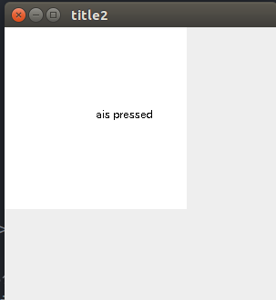

# Swing上での入力

## マウスからの入力
```java
import javax.swing.*;
import java.awt.*;
import java.awt.event.MouseEvent;
import java.awt.event.MouseListener;

public class MouseInput {
    public static void main(String[] args) {
        MouseInput mouseInput = new MouseInput();
    }

    public MouseInput() {
        JFrame frame = new JFrame("title2");
        frame.setDefaultCloseOperation(JFrame.EXIT_ON_CLOSE);
        frame.setSize(300, 300);
        frame.setVisible(true);

        MyJPanel myJPanel = new MyJPanel();
        frame.getContentPane().add(myJPanel);

        myJPanel.setBounds(0, 0, 300, 300);

        myJPanel.addMouseListener(myJPanel);
    }

    class MyJPanel extends JPanel implements MouseListener{

        @Override
        public void mouseClicked(MouseEvent e) {
            Graphics g = getGraphics();
            g.drawString("Clicked", e.getX(), e.getY());
        }

        @Override
        public void mousePressed(MouseEvent e) {

        }

        @Override
        public void mouseReleased(MouseEvent e) {

        }

        @Override
        public void mouseEntered(MouseEvent e) {

        }

        @Override
        public void mouseExited(MouseEvent e) {

        }
    }
}
```

<br>

内部クラスMyJPanelのところに、implements MouseListenerと追加します。
```java
class MyJPanel extends JPanel implements MouseListener{

}
```

次に、mouseClicked の中に下記のコードを追加します。
```java
Graphics g = getGraphics();
g.drawString("Clicked", e.getX(), e.getY());
```

すると、このような実行結果になります。
クリックするたびに、Clickedと表示されます。




## キー入力
```java
import javax.swing.*;
import java.awt.*;
import java.awt.event.KeyEvent;
import java.awt.event.KeyListener;

public class KeyInput {
    public static void main(String[] args) {
        KeyInput keyInput = new KeyInput();
    }

    public KeyInput() {
        JFrame frame = new JFrame("title2");
        frame.setDefaultCloseOperation(JFrame.EXIT_ON_CLOSE);
        frame.setSize(300, 300);
        frame.setVisible(true);

        MyJPanel myJPanel = new MyJPanel();
        frame.getContentPane().add(myJPanel);

        myJPanel.setBounds(0, 0, 300, 300);

        myJPanel.setFocusable(true);
        myJPanel.addKeyListener(myJPanel);
    }

    class MyJPanel extends JPanel implements KeyListener {

        @Override
        public void keyTyped(KeyEvent e) {
        }

        @Override
        public void keyPressed(KeyEvent e) {
            Graphics g = getGraphics();

            g.setColor(Color.WHITE);
            g.fillRect(0,0,200,200);

            g.setColor(Color.BLACK);
            g.drawString(e.getKeyChar() + "is pressed", 100, 100);
        }

        @Override
        public void keyReleased(KeyEvent e) {

        }
    }
}
```

実行結果


