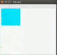

# Swingでのアニメーションとダブルバッファリング

まず、以下のコードを実行してみましょう

```java
import javax.swing.*;
import java.awt.*;

public class NotDoubleBuffer {
    public static void main(String[] args) {
        NotDoubleBuffer notDoubleBuffer = new NotDoubleBuffer();
    }

    public NotDoubleBuffer() {
        JFrame frame = new JFrame("title2");
        frame.setDefaultCloseOperation(JFrame.EXIT_ON_CLOSE);
        frame.setSize(300, 300);
        frame.setVisible(true);

        MyJPanel myJPanel = new MyJPanel();
        frame.getContentPane().add(myJPanel);

        myJPanel.setBounds(0, 0, 300, 300); // 学内環境だと必要
        myJPanel.game();
    }

    class MyJPanel extends JPanel {
        Graphics g;

        public void game() {
            g = getGraphics();

            int x = 0;

            while(true){
                g.setColor(Color.WHITE);
                g.fillRect(0, 0, 300, 300);
                g.setColor(Color.CYAN);
                g.fillRect(x, 0, 100, 100);

                x++;
                try {
                    Thread.sleep(1000);
                } catch (InterruptedException e) {
                    e.printStackTrace();
                }
            }
        }
    }
}
```

実行してみると、変な挙動をしたり、画面がちらついたりすると思います。

<br>

これを修正するために、ダブルバッファリングというテクニックを使います。
以下が完成したコードです。

```java
import java.awt.Color;
import java.awt.Graphics;
import java.awt.Image;

import javax.swing.JFrame;
import javax.swing.JPanel;

public class SwingSample5 {
	public static void main(String[] args) {
		SwingSample5 sample5 = new SwingSample5();
	}

	public SwingSample5() {
		JFrame frame = new JFrame("title2");
		frame.setDefaultCloseOperation(JFrame.EXIT_ON_CLOSE);
		frame.setSize(300, 300);
		frame.setVisible(true);

		MyJPanel myJPanel = new MyJPanel();
		frame.getContentPane().add(myJPanel);

		myJPanel.setBounds(0, 0, 300, 300); // 学内環境だと必要
		myJPanel.game();
	}

	class MyJPanel extends JPanel {
		Graphics g;

		public void game() {
			Image img = createImage(300,300);
			g = img.getGraphics();
			Graphics wg = getGraphics();

			int x = 0;

			while(true){
				g.setColor(Color.WHITE);
				g.fillRect(0, 0, 300, 300);
				g.setColor(Color.CYAN);
				g.fillRect(x, 0, 100, 100);

				x++;
				wg.drawImage(img, 0,0,null);
				try {
					Thread.sleep(10);
				} catch (InterruptedException e) {
					e.printStackTrace();
				}
			}
		}
	}
}
```

実行結果はこのような感じです。


